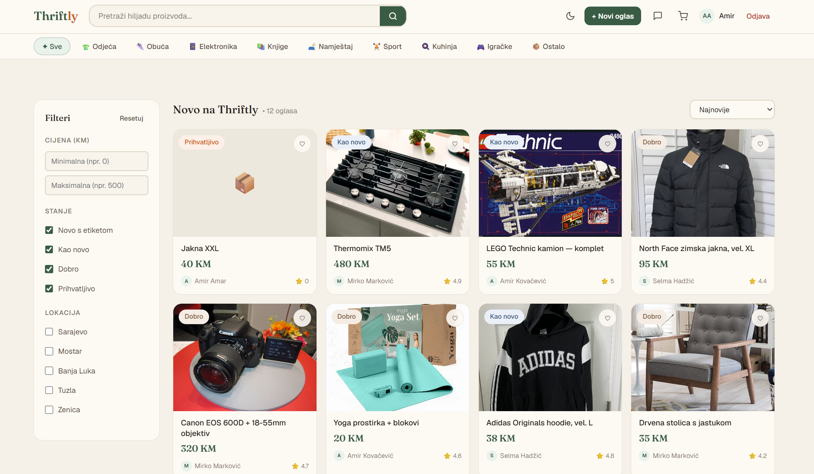
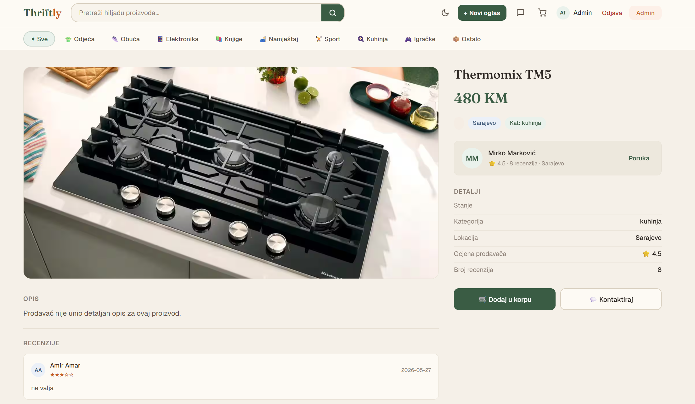
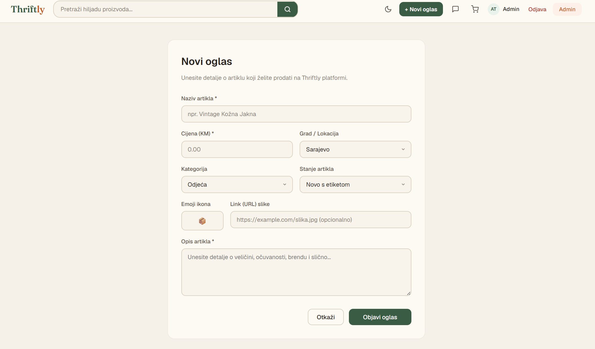
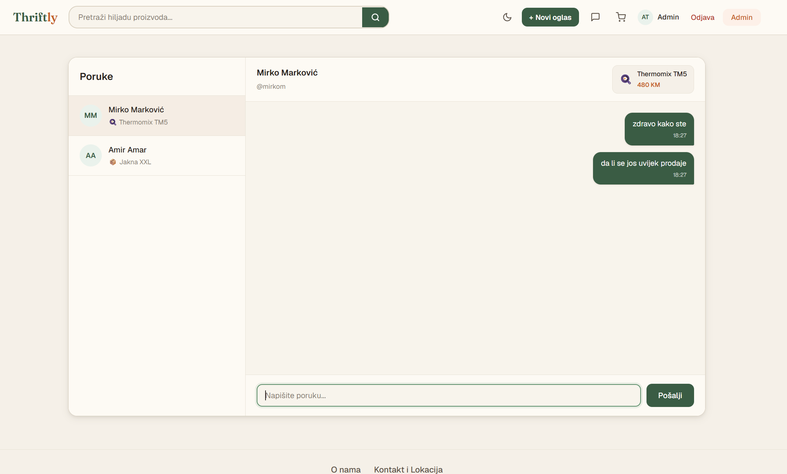
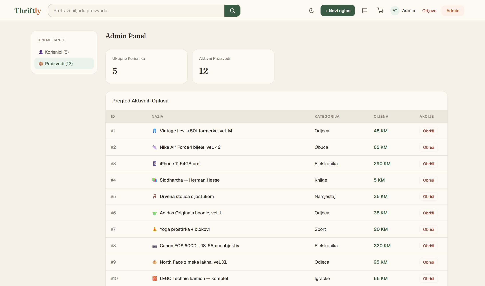
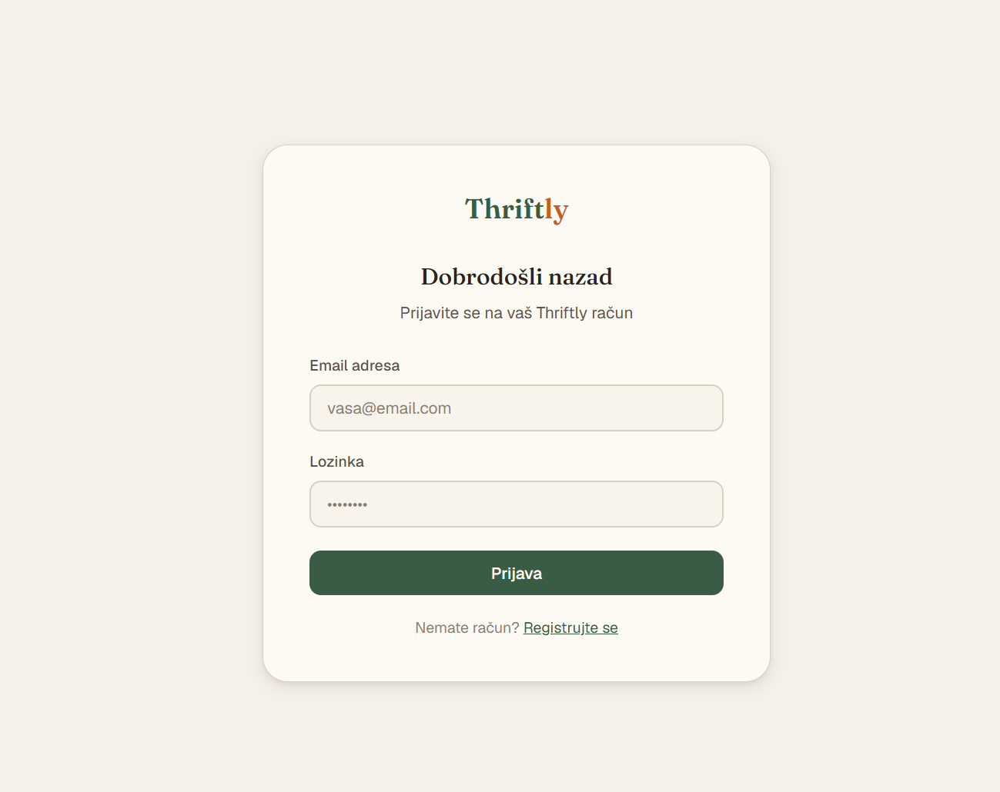
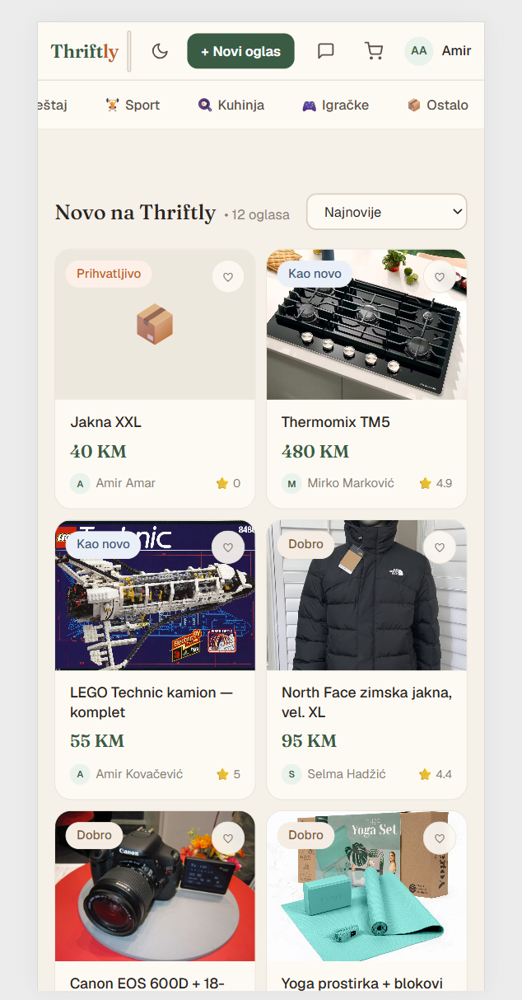

# 🛍️ Thriftly

> Web aplikacija za kupovinu i prodaju polovnih predmeta — potpuno dockerizirana, pokrenuta jednom komandom.

**Predmet:** Dizajn Web Stranica & Operativni sistemi i računarstvo u oblaku  
**Institucija:** Univerzitet u Zenici — Politehnički fakultet, Softverski Inženjering  
**Tim:** Adin Saletović · Mario Šantić · Žepačkić Toni

---

## Sadržaj

- [Opis aplikacije](#opis-aplikacije)
- [Tech stack](#tech-stack)
- [Arhitekturni dijagram](#arhitekturni-dijagram)
- [Pregled dockerizacije](#pregled-dockerizacije)
  - [Dockerfile – Frontend (React)](#dockerfile--frontend-react)
  - [Dockerfile – Backend (json-server)](#dockerfile--backend-json-server)
  - [Docker Compose](#docker-compose)
- [Korisničke uloge i prava pristupa](#korisničke-uloge-i-prava-pristupa)
- [Paleta boja i fontovi](#paleta-boja-i-fontovi)
- [Upute za lokalno pokretanje](#upute-za-lokalno-pokretanje)
- [Produkcijski URL (GCP)](#produkcijski-url-gcp)
- [Članovi tima i doprinos](#članovi-tima-i-doprinos)

---

## Opis aplikacije

**Thriftly** je web aplikacija namijenjena kupovini i prodaji polovnih predmeta. Platforma omogućava korisnicima da:

- objave vlastite predmete na prodaju
- pretražuju i filtriraju ponudu ostalih korisnika
- komuniciraju putem internog chat sistema
- upravljaju svojom košaricom i narudžbama

Cilj aplikacije je pružiti pristupačnu i intuitivnu platformu koja promovira **cirkularne ekonomske prakse** — produžavanje životnog vijeka predmeta i smanjenje nepotrebnog otpada.

---

## Tech stack

| Tehnologija | Verzija | Namjena |
|-------------|---------|---------|
| React | 18.2.0 | Frontend UI framework |
| React Router DOM | 6.22.0 | Klijentsko rutiranje |
| Node.js | 18.x / 22.x | Runtime okruženje |
| json-server | Najnovija | Mock REST API / backend |
| nginx | Alpine | Web server i reverse proxy |
| Docker | 24.x+ | Kontejnerizacija aplikacije |
| Docker Compose | 2.x | Orkestracija multi-container setup-a |

---

## Arhitekturni dijagram

Aplikacija se sastoji od dva Docker servisa koja komuniciraju unutar zajedničke Docker mreže:

```
┌─────────────────────────────────────────────────────────┐
│                     Docker Compose                       │
│                                                          │
│   ┌──────────────────────┐   ┌──────────────────────┐   │
│   │   frontend           │   │   backend            │   │
│   │   (React + nginx)    │   │   (json-server)      │   │
│   │                      │   │                      │   │
│   │  PORT: 8080:80       │   │  PORT: 5000:5000     │   │
│   │                      │   │                      │   │
│   │  nginx → /api/*      │──▶│  db.json (REST API)  │   │
│   │  proxy_pass :5000    │   │                      │   │
│   └──────────────────────┘   └──────────┬───────────┘   │
│              ▲                           │               │
│              │                    named volume           │
│           Browser                  (db-data)            │
└─────────────────────────────────────────────────────────┘
```

Frontend servis prima HTTP zahtjeve na portu **8080**. Sve rute koje počinju s `/api/` nginx proksira na backend koji sluša na portu **5000**. Podaci se čuvaju u named volumenu `db-data` kako bi perzistirali i nakon ponovnog pokretanja kontejnera.

---

## Pregled dockerizacije

Aplikacija je dockerizovana kao multi-container sistem koji se pokreće jednom komandom:

```bash
docker compose up --build
```

Struktura projekta:

```
FinalniProjekt/
├── frontend/
│   ├── Dockerfile
│   ├── nginx.conf
│   └── src/
├── backend/
│   ├── Dockerfile
│   └── db.json
└── docker-compose.yml
```

### Dockerfile – Frontend (React)

Frontend koristi **multi-stage build** kako bi se minimizirala veličina finalnog Docker imagea:

- **Build faza** — Node.js 22 Alpine kompajlira React aplikaciju u produkcijski build
- **Serve faza** — nginx:alpine servisira statičke fajlove i proxy-ira API pozive na backend

```dockerfile
FROM node:22-alpine AS build

WORKDIR /app

COPY package*.json ./

RUN npm ci --legacy-peer-deps || npm install --legacy-peer-deps

COPY . .

RUN npm run build

FROM nginx:alpine
COPY --from=build /app/dist /usr/share/nginx/html
COPY nginx.conf /etc/nginx/conf.d/default.conf
EXPOSE 80
CMD ["nginx", "-g", "daemon off;"]
```

#### nginx.conf konfiguracija

Nginx konfiguracija podržava React Router putem `try_files` direktive, te proxy-ira sve `/api/` zahtjeve na backend servis:

```nginx
server {
    listen 80;
    server_name localhost;

    location / {
        root /usr/share/nginx/html;
        index index.html index.htm;
        try_files $uri $uri/ /index.html;
    }

    location /api/ {
        proxy_pass http://backend:5000/;
        proxy_http_version 1.1;
        proxy_set_header Upgrade $http_upgrade;
        proxy_set_header Connection 'upgrade';
        proxy_set_header Host $host;
        proxy_cache_bypass $http_upgrade;
    }
}
```

> Direktiva `try_files $uri $uri/ /index.html` osigurava da React Router može upravljati rutama na klijentskoj strani bez 404 greške.

---

### Dockerfile – Backend (json-server)

Backend servis koristi `json-server` kao REST API server. Port se konfigurira putem environment varijable:

```dockerfile
FROM node:18-alpine

WORKDIR /app

RUN apk add --no-cache wget

RUN npm install -g json-server

COPY db.json ./data/db.json

EXPOSE 5000

CMD ["sh", "-c", "json-server --watch ./data/db.json --port $PORT --host 0.0.0.0"]
```

> Koriste se Alpine varijante base imagea kako bi finalni image bio manji od **150MB**. Varijabla `$PORT` se ubacuje putem `docker-compose.yml` environment sekcije.

---

### Docker Compose

`docker-compose.yml` definira oba servisa, njihove ovisne veze, varijable u okruženju, named volume za persistenciju podataka te healthcheck mehanizam:

```yaml
services:
  frontend:
    build:
      context: ./frontend
    ports:
      - "8080:80"
    depends_on:
      backend:
        condition: service_healthy

  backend:
    build:
      context: ./backend
    ports:
      - "5000:5000"
    environment:
      - PORT=5000
    volumes:
      - db-data:/app/data
    healthcheck:
      test: ["CMD-SHELL", "wget -qO- http://localhost:5000/users || exit 1"]
      interval: 5s
      timeout: 5s
      retries: 10
      start_period: 10s

volumes:
  db-data:
```

#### Ključne konfiguracije

| Konfiguracija | Objašnjenje |
|---------------|-------------|
| `depends_on: condition: service_healthy` | Frontend čeka da backend postane „zdrav" prije pokretanja |
| Named volume `db-data` | Osigurava persistenciju `db.json` podataka između restartova kontejnera |
| Environment varijabla `PORT` | Port nije hardkodiran u kodu — injektuje se iz Compose fajla |
| Healthcheck | Periodično provjerava dostupnost backend API-ja putem `wget` zahtjeva |

#### Healthcheck detalji

Healthcheck šalje HTTP zahtjev na `/users` endpoint svakih **5 sekundi**. Kontejner dobiva **10 sekundi** start perioda prije nego što neuspjeli checkovi počnu biti relevantni. Nakon **10 neuspjelih** pokušaja, kontejner se označava kao `unhealthy`.

#### Named Volume i persistencija

Named volume `db-data` se montira na `/app/data` direktorij unutar backend kontejnera. Docker inicijalizuje volume s `db.json` fajlom iz imagea pri prvom pokretanju. Sve izmjene podataka su trajne i preživljavaju restartove kontejnera.

---

## Korisničke uloge i prava pristupa

| Uloga | Prava pristupa |
|-------|----------------|
| **Gost** (neregistriran) | Pregled proizvoda, pretraga, filtriranje po kategorijama i cijeni. Nema pristupa košarici, chatu, profilu ni objavljivanju. |
| **Korisnik** (registriran) | Sve što može gost + dodavanje u košaricu, kupovina, objava proizvoda, chat s prodavačima, upravljanje vlastitim profilom i listama. |
| **Administrator** | Puni pristup svemu + admin panel: upravljanje korisnicima (aktivacija/deaktivacija), upravljanje svim proizvodima, pregled statistika platforme. |

> Administratorska uloga se dodjeljuje direktnim unosom u bazu (`db.json` — polje `is_admin: true`). Nije predviđena registracija administratora putem sučelja.

---

## Paleta boja i fontovi

### Paleta boja

| Varijabla | Hex | Primjena |
|-----------|-----|----------|
| `--bg` | `#F5F0E8` | Pozadina |
| `--bg-card` | `#FDFAF4` | Karte |
| `--green-primary` | `#3A5C44` | Primarna zelena |
| `--green-mid` | `#5A8C68` | Srednja zelena |
| `--orange-accent` | `#C45E28` | Narandžasta (akcent) |
| `--denim-info` | `#3E5878` | Denim (info) |
| `--text-primary` | `#2A2420` | Primarni tekst |
| `--text-secondary` | `#5C5248` | Sekundarni tekst |
| `--danger` | `#B03A2E` | Crvena (opasnost) |
| `--brown` | `#7A5C44` | Smeđa |

Svaka primarna boja ima i svjetlu varijantu za pozadine (npr. `--green-light: #EAF2EC`, `--orange-light: #FDF0E8`, `--denim-light: #EBF0F8`). Aplikacija podržava i **tamni mod (dark mode)** s odgovarajućim varijantama.

### Fontovi

- **Fraunces** *(Google Fonts)* — display font; koristi se za naslove, logotip, cijene i istaknute elemente. Serifni font daje topao karakter aplikaciji.
- **Geist** *(Vercel)* — UI font; koristi se za sve navigacijske elemente, forme, opise i dugmad. Moderan sans-serif font optimiziran za čitljivost na ekranu.

---

## Upute za lokalno pokretanje

### Preduvjeti

Prije pokretanja aplikacije, potrebno je imati instalirano:

- [Docker Desktop](https://www.docker.com/products/docker-desktop/) (v24.0+)
- Docker Compose (uključen u Docker Desktop)
- Git (za kloniranje repozitorija)
- Slobodni portovi: **8080** (frontend) i **5000** (backend)

### Koraci za pokretanje

**1. Kloniraj repozitorij**

```bash
git clone https://github.com/mariosantic25-commits/dws-projekat-P
cd rootFolder
```

**2. Pokreni aplikaciju**

```bash
docker compose up --build
```

Docker će automatski:
- buildati frontend image (Node.js kompajlira React app, nginx servisira build)
- buildati backend image (json-server sa `db.json`)
- pokrenuti healthcheck na backend servisu (10 pokušaja, interval 5s)
- pokrenuti frontend tek kad je backend zdrav (`depends_on: condition: service_healthy`)

**3. Otvori aplikaciju u browseru**

```
http://localhost:8080
```

**Zaustavljanje aplikacije**

```bash
docker compose down
```

Za brisanje i volumena (podataka):

```bash
docker compose down -v
```

### Testni računi

Aplikacija dolazi s predefiniranim korisnicima u `db.json`.

| Uloga | Email | Password |
|-------|-------|----------|
| Administrator | admin@thriftly.ba | admin123 |

Za admin pristup, pronađi korisnika s poljem `is_admin: true` u `backend/db.json`.

---

## Produkcijski URL (GCP)

> ⚠️ **GCP deployment je u toku.** Aplikacija još nije javno dostupna na produkcijskom URL-u.

Ovaj odjeljak bit će dopunjen čim se završi postavljanje na Google Cloud Platform (Compute Engine VM s Docker + systemd autostart i HTTPS konfiguracijom).

---

## Članovi tima i doprinos

| Član | Doprinos |
|------|----------|
| **Adin Saletović** | Dockerfajlovi, nginx.conf, većina JavaScript fajlova |
| **Mario Šantić** | Stranice proizvoda (Home, ProductDetail, AddProduct itd.), routes, app i main JSX, JSON database, pomoć pri integraciji OSIRUO dijelova |
| **Žepačkić Toni** | Komponente, kontekst i cijela CSS stilizacija |

---

## Snimci Ekrana

### Home Stranica


### Prikaz proizvoda


### Home Stranica


### Novi oglas


### Chat


### Admin Panel


### Prijava


### Prikaz na telefonu


*Zenica, 2026.*
